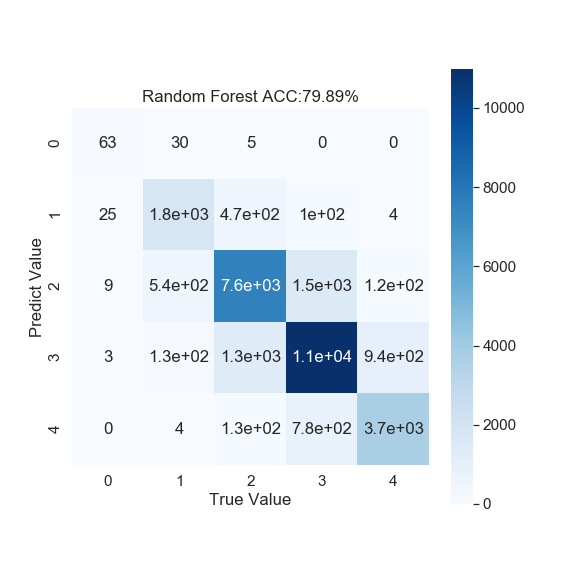
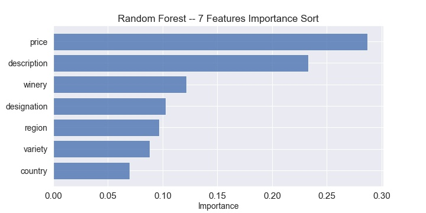
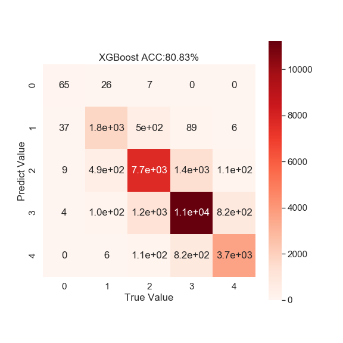
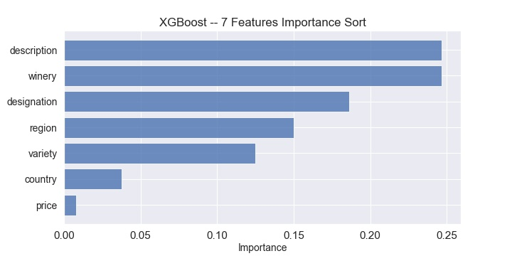

# Wine_Review

## 1. About

**A predictive model to identify wines' quality through 10 features.**

Dataset can be downloaded [here](https://www.kaggle.com/zynicide/wine-reviews).

The data consists of `10` fields:

> - *Points*: the number of points WineEnthusiast rated the wine on a scale of 1-100 (though they say they only post reviews for wines that score >=80)
> 
> - _Title_: the title of the wine review, which often contains the vintage if you're interested in extracting that feature
> 
> - _Variety_: the type of grapes used to make the wine (ie Pinot Noir)
> 
> - _Description_: a few sentences from a sommelier describing the wine's taste, smell, look, feel, etc.
> 
> - _Country_: the country that the wine is from
> 
> - _Province_: the province or state that the wine is from
> 
> - _Region 1_: the wine growing area in a province or state (ie Napa)
> 
> - _Region 2_: sometimes there are more specific regions specified within a wine growing area (ie Rutherford inside the Napa Valley), but this value can sometimes be blank
> 
> - _Winery_: the winery that made the wine
> 
> - _Designation_: the vineyard within the winery where the grapes that made the wine are from
> 
> - _Price_: the cost for a bottle of the wine
> 
> - _Taster Name_: name of the person who tasted and reviewed the wine
> 
> - _Taster Twitter Handle_: Twitter handle for the person who tasted ane reviewed the wine

## 2. Data Preprocess

I used the **winemag-data_first150k.csv** which contains about `150k` samples information.Data encoding and other preprocessing actions can be detailed checked in file **data_preprocess.ipynb**.

There were only 2 different actions I took in data preprocessing, however, there occured hug performance gap between validation model and test model, which may blame the `feature importance` is accounted for a big propertion durinhg model training.

#### **Validation model**

- In validation model, I drop the `'description'` feature for the reason I think this contributes nothing to wine quality, which proves to be not proper.

- Then I merge `'region 1'` and `'region 2'` to `'region'`.

#### Test model

- In test model, I encode `'description'` to numeric type by the value of length of the description sentence.

- Then I merge `'province'`, `'region 1'` and `'region 2'` to `'region'`.

Results shows that feature engineering is much better in test model, which contributes to it has about **15% higher** prediction accuracy than validation model does.

## 3. Modeling

I chose `Random Forest` and `XGBoost` to validate this 5-classification task.

#### **Randon Forest (ACC: 81.52%)**

- Confusion Matrix:

- Feature importance:

#### **XGBoost (ACC: 81.95%)**

- Confusion Matrix:

- Feature importance:

